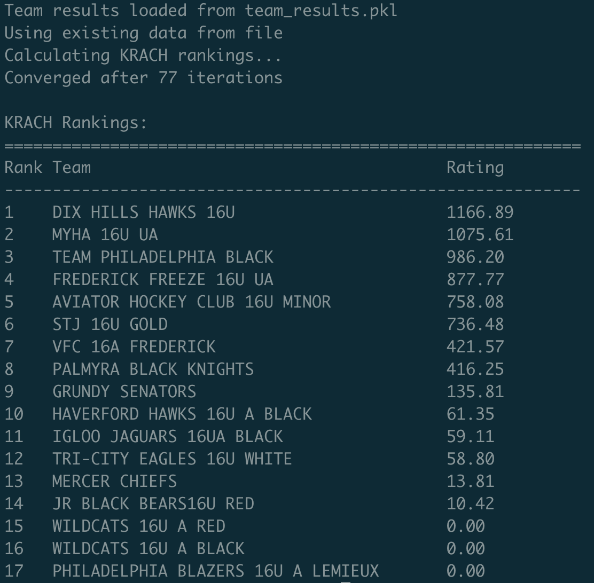

# Bradley Terry Model For Sports Team Rankings

An implementation of a Bradley Terry Model to generate [KRACH Rankings](https://hockeypowerrankings.com/About.html) for an ice hockey league that I worked with.

The **Bradley–Terry model** is a [probability model](https://en.wikipedia.org/wiki/Probability_theory) for the outcome of pairwise comparisons between items, teams, or objects.
Given a pair of items $i$ and $j$ drawn from some [population](https://en.wikipedia.org/wiki/Population_(statistics)), it estimates the probability that the [pairwise comparison](https://en.wikipedia.org/wiki/Pairwise_comparison_(psychology)) $i > j$ turns out true, as


$$
\Pr(i > j) = \frac{p_i}{p_i + p_j}
$$

*Equation 1*

where $p_i$ is a positive [real-valued](https://en.wikipedia.org/wiki/Real_number) score assigned to individual $i$.  The comparison $i > j$ can be read as " $i$ is preferred to $j$ ", " $i$ ranks higher than $j$ ", or " $i$ beats $j$ ", depending on the application.

For example, $p_i$ might represent the skill of a team in a sports tournament and $\Pr(i > j)$ the probability that $i$ wins a game against $j$.  Or $p_i$ might represent the quality or desirability of a commercial product and $\Pr(i > j)$ the probability that a consumer will prefer product $i$ over product $j$.


## Installation

1. Install Python dependencies:
```bash
pip install -r requirements.txt
```

2. Install Chrome browser (required for web scraping)

3. Install ChromeDriver:
   - **macOS**: `brew install chromedriver`
   - **Linux**: Download from [ChromeDriver downloads](https://chromedriver.chromium.org/)
   - **Windows**: Download from [ChromeDriver downloads](https://chromedriver.chromium.org/)

## Usage

### Fetch Team Statistics
To scrape and save team statistics from gamesheetstats.com:
```bash
python fetch-stats.py
```

### Calculate KRACH Rankings
To calculate and display KRACH rankings:
```bash
python krach-solver.py
```

The KRACH solver will:
1. First try to load existing data from `team_results.pkl`
2. If no data exists, it will automatically scrape fresh data
3. Calculate KRACH ratings using the Bradley-Terry model
4. Display formatted rankings




### Configuration
Edit `config.py` to modify:
- Division and team IDs
- Web scraping delays
- KRACH algorithm parameters
- File paths

## How It Works

1. **Web Scraping**: Uses Selenium to scrape team statistics
2. **Data Processing**: Builds a pairwise comparison matrix from game results
3. **KRACH Calculation**: Implements the Bradley-Terry model to calculate team ratings
4. **Rankings**: Sorts teams by their KRACH ratings


### Reference

[Bradley-Terry Model | Wikipedia](https://en.wikipedia.org/wiki/Bradley%E2%80%93Terry_model)
